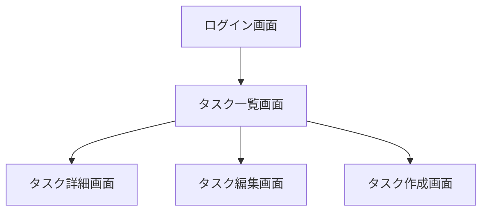

# GoTaskAI 基本設計書 v1.0

---

## 1. 画面設計

### 1.1 画面遷移図

### 1.2 画面項目定義

| 画面名 | 項目名 | 型 | 必須 | 説明 |
|--------|--------|----|------|------|
| ログイン画面 | email | string | ○ | ユーザーのメールアドレス |
| ログイン画面 | password | string | ○ | パスワード |
| タスク作成画面 | title | string | ○ | タスクタイトル |
| タスク作成画面 | description | text | - | タスクの詳細 |
| タスク一覧画面 | タスク一覧 | list | - | ユーザーの登録済みタスク |
| タスク詳細画面 | id | int | ○ | タスクID |
| タスク詳細画面 | title | string | ○ | タスクタイトル |
| タスク詳細画面 | description | text | - | タスクの詳細 |
| タスク詳細画面 | completed | boolean | - | 完了フラグ |

---

## 2. API 仕様（詳細）

### 2.1 ユーザー登録 API
- **URL**: `POST /api/v1/register`
- **Request**
```json
{
  "email": "test@example.com",
  "password": "mypassword"
}
```
- **Response**
```json
{
  "id": 1,
  "email": "test@example.com"
}
```

+ **Status Code**

    - 200: 成功

    - 400: パラメータ不正

    - 409: メールアドレス重複

### 2.2 ログイン API

- URL: POST /api/v1/login

- **Request**
```json
{
  "email": "test@example.com",
  "password": "mypassword"
}
```

- **Response**
```json
{
  "token": "xxxxx.yyyyy.zzzzz"
}
```

+ Status Code

    - 200: 成功

    - 401: 認証失敗

### 2.3 タスク一覧取得 API

- URL: GET /api/v1/tasks

- Header: Authorization: Bearer <JWT>

- **Response**
```json
{
  "tasks": [
    {"id": 1, "title": "買い物", "description": "牛乳とパンを購入", "completed": false},
    {"id": 2, "title": "レポート提出", "description": "週報をメールで送信", "completed": true}
  ]
}
```

+ Status Code

    - 200: 成功

    - 401: 認証失敗

### 2.4 タスク作成 API
+ URL: POST /api/v1/tasks

+ Header: Authorization: Bearer <JWT>

- **Request**
```json
{
  "title": "新しいタスク",
  "description": "詳細内容"
}
```
- **Response**
```json
{
  "id": 3,
  "title": "新しいタスク",
  "description": "詳細内容",
  "completed": false
}
```

+ Status Code

  - 200: 成功

  - 400: パラメータエラー

  - 401: 認証失敗

### 2.5 タスク更新 API

+ URL: PUT /api/v1/tasks/{id}

+ Header: Authorization: Bearer <JWT>

+ **Request**
```json
{
  "title": "更新後タスク",
  "description": "詳細更新",
  "completed": true
}
```

+ **Response**
```json
{
  "id": 3,
  "title": "更新後タスク",
  "description": "詳細更新",
  "completed": true
}
```

+ Status Code

  - 200: 成功

  - 400: パラメータ不正

  - 401: 認証失敗

  - 404: タスク未存在

### 2.6 タスク削除 API

+ URL: DELETE /api/v1/tasks/{id}

+ Header: Authorization: Bearer <JWT>

+ **Response**
```json
{
  "message": "削除成功"
}
```

+ Status Code

    - 200: 成功

    - 401: 認証失敗

    - 404: タスク未存在

### 2.7 AI 提案取得 API

+ URL: GET /api/v1/tasks/{id}/ai

+ Header: Authorization: Bearer <JWT>

+ **Response**
```json
{
  "task_id": 3,
  "summary": "このタスクは本日中に実行すべきです。",
  "priority": "high"
}
```
+ Status Code

    - 200: 成功

    - 401: 認証失敗

    - 404: タスク未存在

## 3. エラーメッセージ一覧

| コード  | メッセージ                  | 説明               |
|---------|-----------------------------|--------------------|
| ERR001  | Invalid email or password   | ログイン認証エラー |
| ERR002  | Title is required           | タスクタイトル未入力 |
| ERR003  | Unauthorized access         | JWT 無効           |
| ERR004  | Task not found              | 指定タスクが存在しない |