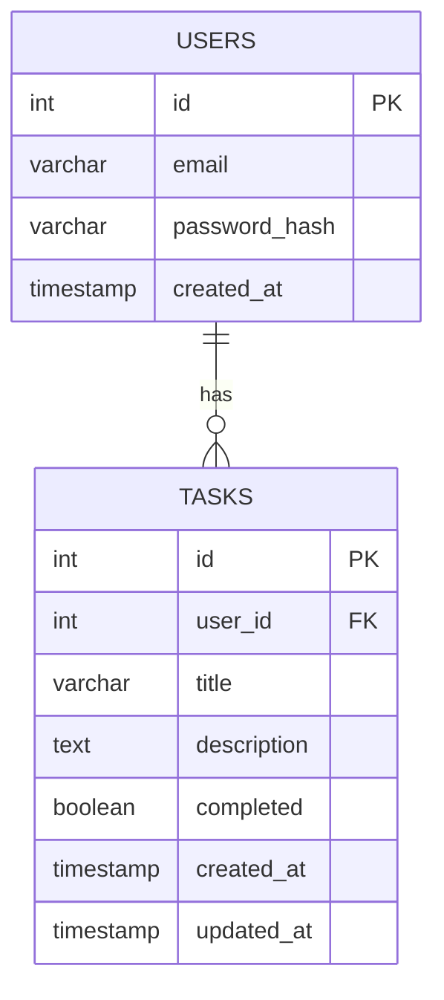

# GoTaskAI データベース設計書 v1.0

---

## 1. 概要
本ドキュメントは、GoTaskAI システムで利用するデータベース (PostgreSQL) の詳細設計を記載する。  
基本設計書に記載した概要に基づき、テーブル定義・ER 図・インデックス設計を明確化する。

---

## 2. ER 図

## 3. テーブル定義

### 3.1 users テーブル

| カラム名       | 型            | 制約             | 説明                 |
|----------------|--------------|------------------|----------------------|
| id             | SERIAL       | PK               | ユーザーID           |
| email          | VARCHAR(255) | UNIQUE, NOT NULL | メールアドレス       |
| password_hash  | VARCHAR(255) | NOT NULL         | ハッシュ化パスワード |
| created_at     | TIMESTAMP    | DEFAULT now()    | 作成日時             |

---

### 3.2 tasks テーブル

| カラム名    | 型            | 制約                  | 説明                 |
|-------------|--------------|-----------------------|----------------------|
| id          | SERIAL       | PK                    | タスクID             |
| user_id     | INT          | FK → users.id         | 所属ユーザー         |
| title       | VARCHAR(255) | NOT NULL              | タスクタイトル       |
| description | TEXT         | -                     | タスク詳細           |
| completed   | BOOLEAN      | DEFAULT false         | 完了フラグ           |
| created_at  | TIMESTAMP    | DEFAULT now()         | 作成日時             |
| updated_at  | TIMESTAMP    | DEFAULT now()         | 更新日時             |

---

## 4. インデックス設計

- `users(email)` → ログイン時検索高速化  
- `tasks(user_id)` → ユーザー別タスク一覧取得を高速化  

---

## 5. サンプルデータ

本章では、開発・テスト環境で利用する初期データ例を記載する。  
これにより、API と DB の連携確認や画面表示テストを容易にする。  

### 5.1 users サンプルデータ
```sql
INSERT INTO users (email, password_hash, created_at) VALUES
('alice@example.com', '$2a$10$xxxx', now()),
('bob@example.com', '$2a$10$yyyy', now());
```

### 5.2 tasks サンプルデータ

```sql
INSERT INTO tasks (user_id, title, description, completed, created_at, updated_at) VALUES
(1, '牛乳を買う', 'スーパーで2本購入', false, now(), now()),
(2, 'レポート提出', '週次レポートをメール送信', true, now(), now());
```

## 6. マイグレーション方針（任意）

将来的にテーブル構造やインデックスを変更する場合の運用方針を示す。  
本番環境では手動で SQL を実行するのではなく、マイグレーションツールを利用する。  

### 6.1 推奨ツール
- Flyway  
- Liquibase  
- Goose (Go プロジェクト向け)  

### 6.2 運用ルール
1. **バージョン管理**  
   - `migrations/` ディレクトリに、`V1__init.sql`, `V2__add_index.sql` のようにファイルを配置する。  
2. **レビュー必須**  
   - スキーマ変更は Pull Request 経由でレビューを行う。  
3. **下位互換性の考慮**  
   - 既存データを壊さないように `NULL` 許可やデフォルト値を利用する。  
4. **テスト環境での検証**  
   - 本番環境へ適用する前に、必ずステージング環境で動作確認を行う。  
