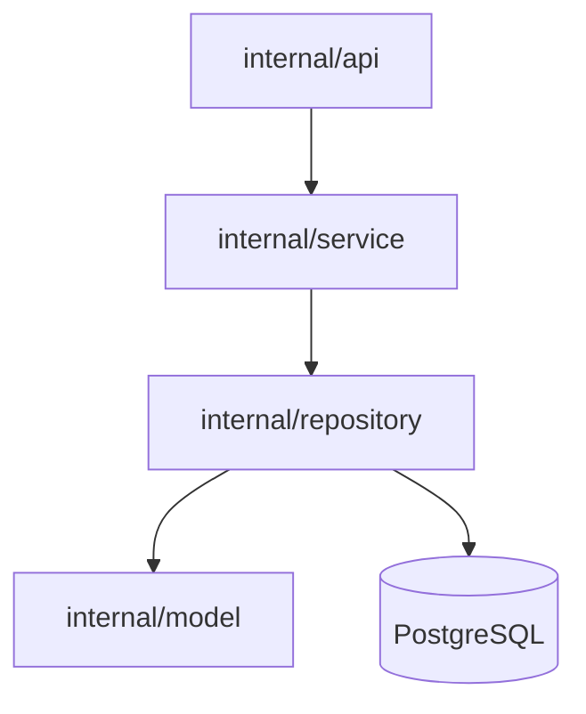

# GoTaskAI 基本設計書 v1.0

---

## 1. 文書目的
本ドキュメントは、GoTaskAI システムの **モジュール構成と役割** を定義する。  
コード実装に入る前に、各モジュールの責務と依存関係を明確化し、開発効率と保守性を高めることを目的とする。

---

## 2. モジュール構成図



## 3. モジュール定義

### 3.1 internal/model

**役割**
- DB テーブルと Go 構造体 (struct) の対応付け
- JSON シリアライズ/デシリアライズ用タグの付与

**代表ファイル**
- `user.go` → users テーブル対応
- `task.go` → tasks テーブル対応

**例**
```go
type User struct {
    ID        int       `db:"id" json:"id"`
    Email     string    `db:"email" json:"email"`
    Password  string    `db:"password_hash"`
    CreatedAt time.Time `db:"created_at"`
}
```
### 3.2 internal/repository

**役割**
- DB との直接的なやり取り（SQL 発行）
- `sqlx` を利用して CRUD 操作を実装

**代表ファイル**
- `user_repository.go`
- `task_repository.go`

**責務**
- `FindByEmail(email string) (*User, error)`
- `CreateTask(userID int, title, description string) error`

---

### 3.3 internal/service

**役割**
- ビジネスロジックを実装
- リポジトリ層を呼び出してデータ取得/更新
- パスワードハッシュ化、認証、権限チェック

**代表ファイル**
- `user_service.go`
- `task_service.go`

**責務**
- `RegisterUser(email, password string)`
- `LoginUser(email, password string)`
- `MarkTaskCompleted(taskID int)`

---

### 3.4 internal/api

**役割**
- Gin を利用した HTTP ハンドラ
- リクエスト受信 → Service 呼び出し → レスポンス返却

**代表ファイル**
- `user_handler.go`
- `task_handler.go`

**エンドポイント例**
- `POST /users` → ユーザー登録
- `POST /login` → ログイン
- `GET /tasks` → タスク一覧取得
- `POST /tasks` → タスク追加

---

### 3.5 internal/db

**役割**
- DB 接続の初期化 (`sqlx.Connect`)
- コネクションプール管理

**代表ファイル**
- `db.go`

---

## 4. 開発ルール

**依存関係の方向性**
- `api → service → repository → model`
- 下位層から上位層を参照しないこと。

**テスト方針**
- repository 層 → DB モックで単体テスト
- service 層 → ビジネスロジック検証
- api 層 → HTTP リクエスト/レスポンスの統合テスト

**エラー処理**
- 共通エラーコードは API 設計書の「エラーメッセージ一覧」に準拠

---

## 5. 今後の拡張
- 認証に JWT を導入予定
- AWS S3 を利用したファイル保存拡張
- OpenAI API 連携による AI 機能追加
